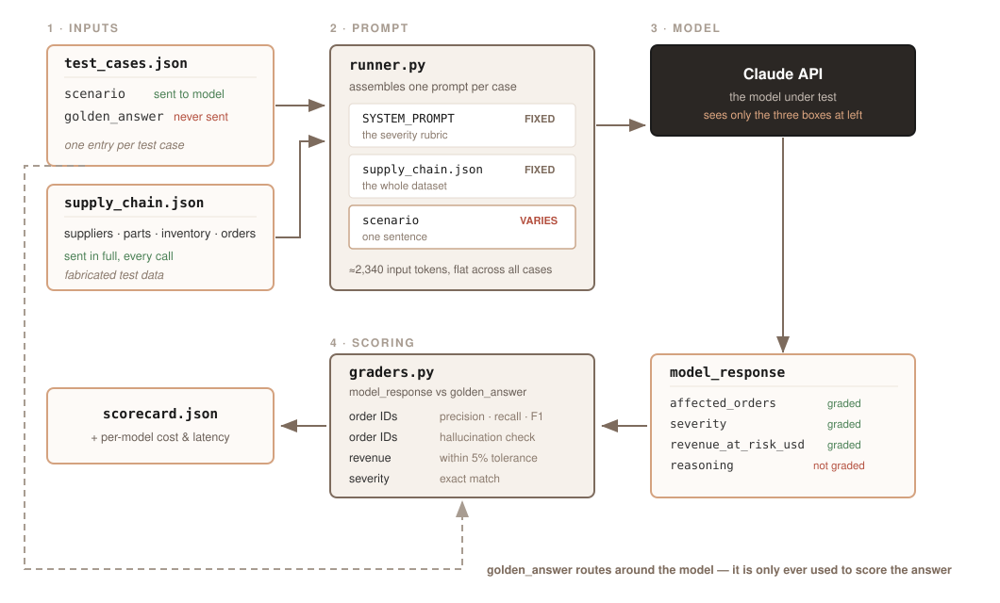

# LLM Evaluation Harness for Manufacturing Supply Chain

A small, dependency-light evaluation harness that scores Claude models on a structured
supply-chain risk-analysis task. Each test case presents a disruption scenario against a
fixed dataset; the model must return JSON naming the affected orders, a severity band, the
revenue at risk, and its reasoning. Four independent graders score the structured fields
against hand-derived golden answers. It was built to answer a narrow question honestly —
*can this model apply a stated rubric to small numeric data, reliably?* — rather than to
produce a headline score, and most of what it has surfaced so far has been defects in the
harness and the prompt rather than in the models.

> **All supply chain data in this repository is fabricated.** The suppliers, parts,
> inventory levels, purchase orders, customers, revenue figures and lead times in
> `data/supply_chain.json` are invented for testing. They describe no real company,
> supplier, or commercial relationship, and none of the numbers should be treated as
> reflecting real-world logistics.



This harness — code, fixtures, and documentation — was built with
[Claude Code](https://claude.com/claude-code).

## Quickstart

Requires Python 3.11+ (developed on 3.14) and an Anthropic API key. Nothing in the harness
code needs more than 3.10, but `pandas` 3.x declares `Requires-Python >= 3.11`, so that is the
practical floor for the install command below.

```bash
git clone https://github.com/dale-rossi/supply-chain-eval-harness
cd supply-chain-eval-harness
python3 -m venv venv && source venv/bin/activate
pip install anthropic pandas python-dotenv
```

There is no `requirements.txt`; those three packages are the whole dependency set.

Create a `.env` in the repo root (it is gitignored):

```
ANTHROPIC_API_KEY=sk-ant-...
```

`runner.py` loads it via python-dotenv. An `ANTHROPIC_API_KEY` already exported in your
shell takes precedence. The dotenv import is optional — the plain environment-variable path
works without the package installed.

Run a sweep. All scripts use relative paths, so run them from the repo root:

```bash
python runner.py        # 7 cases x 5 runs = 35 API calls -> results.json
python report.py        # grades results.json -> scorecard.json + table
python cost_analysis.py # -> cost_actual.csv, cost_hypothetical.csv
```

Useful overrides:

```bash
HARNESS_MODEL=claude-haiku-4-5-20251001 python runner.py  # pick a model
HARNESS_RUNS_PER_CASE=1 python runner.py                  # single run, fast + cheap
```

A full sweep of both models at 5 runs each is 70 calls, roughly $0.86 and ~15 minutes.
Drop `HARNESS_RUNS_PER_CASE` to 1 while iterating on a prompt or fixture.

## Architecture

Four stages in dependency order, with cost analysis hanging off the runner's output:

```
data/ ──> runner.py ──> graders.py ──> report.py
              └──────> cost_analysis.py
```

**`data/`** — `supply_chain.json` holds the fabricated dataset (8 suppliers, 7 parts,
11 orders, `as_of_date` 2026-08-03), deliberately small enough that every golden answer can
be worked out by hand. `test_cases.json` holds 7 scenarios, each with its golden answer.

**`runner.py`** — builds one prompt per (case, run), calls the Messages API, and extracts
JSON from the response. `RUNS_PER_CASE` defaults to 5; temperature is left at the API
default so runs genuinely vary. Writes `results_<model>.json` as a per-model archive and
copies it to `results.json` for the downstream stages. Records per-case timing
(`api_call_ms`, `output_tokens_per_sec`, and others) that nothing currently reads.

Parse failures are treated as data, not exceptions: `extract_json` tries bare JSON, then a
fenced `json` block, then the last `{` in the text. If all three fail it stores
`{"parse_error": true, "raw": ...}`, the graders short-circuit on that key, and the report
prints a parse-error row instead of crashing the sweep.

**`graders.py`** — pure functions, no I/O. The only part with real logic.

**`report.py`** — grades every run, then aggregates by case into a mean F1, a `k/n` pass
count per boolean column, and a **Stable** flag. Writes `scorecard.json` as
`{"by_case": [...], "runs": [...]}`.

**`cost_analysis.py`** — globs `results_*.json` for true per-model cost, and separately
prices one run-averaged pass over the suite at every model's published rate. That pricing
table is maintained by hand and carries dated caveats; cross-model-family estimates are
approximate because tokenizers differ.

### Portability

The scoring layer is provider-agnostic. `graders.py` has no imports at all — it is pure set and
numeric comparison over dictionaries — and `report.py` imports only `json` and the graders. The
fixtures in `data/` are plain JSON describing a task, with nothing model- or vendor-specific in
them. None of that would need to change to score a different model.

`HARNESS_MODEL` swaps between Claude models, and that is the extent of what works today.

Pointing the harness at an open-weights model served by vLLM or Ollama has **not** been done.
It would take replacing the client in `runner.py` — `from anthropic import Anthropic` and the
`client.messages.create(...)` call are the only provider-specific code in the repo — with a call
against an OpenAI-compatible endpoint, then mapping that response's text and token counts into
the same record shape the graders already expect. `cost_analysis.py` would also need a
`PRICING_PER_MTOK` entry for the new model, since it silently skips any model missing from that
table. The `extract_json` fallback chain — bare JSON, fenced block, last `{` — already assumes a
model may wrap its output in prose, which is the usual friction when moving a structured-output
prompt to a model not tuned for it.

## The graders

Four independent scores per run. There is deliberately **no blended overall score** — each
column isolates a different reasoning step, so a failure tells you *which* step broke.

| grader | field | what it measures |
|---|---|---|
| `grade_order_ids` | `affected_orders` | set precision / recall / F1 |
| `grade_revenue` | `revenue_at_risk_usd` | numeric match within 5% |
| `grade_hallucination` | `affected_orders` | any cited order ID absent from the dataset |
| `severity_match` | `severity` | exact string match against the band |

**Why hallucination is separate from precision.** Citing `SO-9999`, which exists nowhere, is
a different failure from citing `SO-4002`, which is real but wrong for this scenario.
Precision/recall already penalise the second. The hallucination grader isolates the first,
because fabricating an identifier is a qualitatively worse error than misapplying a rule.

**The both-empty convention.** Three of the seven goldens are correctly empty. Scoring an
empty prediction against an empty golden requires a convention, because precision and recall
are both undefined at 0/0. Only a genuinely empty match earns 1.0:

```python
if not golden_set and not pred_set:
    precision = recall = f1 = 1.0     # correctly predicting nothing
else:
    precision = tp / (tp + fp) if (tp + fp) else 0.0
    recall    = tp / (tp + fn) if (tp + fn) else 0.0
    f1 = 2 * p * r / (p + r) if (p + r) else 0.0
```

Every other undefined ratio returns 0.0. This matters more than it looks. An earlier version
returned `1.0` for *any* undefined ratio, which meant a prediction completely disjoint from a
non-empty golden scored `f1: 1.0` — a total miss recorded as perfect. It also meant a
non-empty prediction against an empty golden scored `recall: 1.0`. Vacuous truth reads as
success on a scorecard, so the guard is narrow by design.

**The zero-revenue convention.** A golden `revenue_at_risk_usd` of 0 cannot use a percentage
tolerance, since the denominator is zero. Those cases require an exact 0, and `pct_off`
returns `None` to mean undefined rather than pretending to be 0.0.

## Case design

Golden answers are derived by hand from `data/supply_chain.json` under a stated rubric,
not generated by a model. The dataset is kept small specifically so this is tractable.

The rubric: an order is affected when pooled demand for its part, summed across *all* open
orders, exceeds `on_hand + in_transit`. Severity then counts how many of the disrupted part's
suppliers could replenish before the earliest affected due date, using **each supplier's own**
lead time from `as_of_date` — zero → `high`, one → `medium`, two or more → `low`. No shortfall
is `none`.

Three assumptions are stated explicitly in the prompt, and all are simplifications: supplier
capacity is unbounded, customer tier and order priority are out of scope, and the disrupted
supplier never counts as able to deliver (a new PO queues behind the shipment already delayed).

| case | part | golden | what it tests |
|---|---|---|---|
| 1 | P-1010 | `high` | sole-source shortfall, no supplier can make the date |
| 2 | P-1030 | `high` | the disrupted supplier is excluded *even though* its 28-day lead time beats the deadline |
| 3 | P-1040 | `none` | **negative control** — a 4100-unit surplus absorbs the delay entirely |
| 4 | P-1020 | `medium` | per-supplier lead times; Aldridge clears the deadline by two days |
| 5 | P-1050 | `none` | part scoping — the disrupted supplier also supplies a different, genuinely short part |
| 6 | P-1060 | `none` | safety-stock control — `safety_stock` is present in the data but never deducted |
| 7 | P-1070 | `low` | three-sourced part, two healthy suppliers in time |

**Why negative controls exist.** Cases 3, 5 and 6 all have empty golden answers. Without them
a model could score well by pattern-matching "supplier delay" → "orders affected" and never
consult inventory at all. Case 3 is the purest form: a delay at the sole supplier of a part
carrying 4100 units of surplus must still produce an empty answer. Fixtures like these are
easy to "fix" by loosening a grader when a model fails them, which defeats their purpose.

**Fixtures interact, and that is the main hazard.** Case 3 originally lived on P-1020 and was
only correct because pooled demand sat under available supply; adding one order later pushed
that part into shortfall and would have silently converted the harness's only negative control
into a three-order `high` case. It was moved to a part with a large deliberate surplus. For the
same reason case 7 lives on its own part with its own exclusive supplier: adding a third
supplier to P-1020 instead would have flipped case 4 from `medium` to `low` without any test
failing to announce it.

Each fixture also tries to isolate one variable. Case 7 is insensitive to both the
disrupted-supplier rule and safety stock, so a failure there is unambiguously about band
counting.

## Findings

Current results, 5 runs per case per model, `claude-sonnet-4-6` and
`claude-haiku-4-5-20251001`. Severity pass counts shown:

| case | golden | Sonnet 4.6 | Haiku 4.5 |
|---|---|---|---|
| 1 | `high` | 5/5 | 5/5 |
| 2 | `high` | 5/5 | 5/5 |
| 3 | `none` | 5/5 | 5/5 |
| 4 | `medium` | **3/5** | **4/5** |
| 5 | `none` | 5/5 | **3/5** |
| 6 | `none` | 5/5 | 5/5 |
| 7 | `low` | 5/5 | 5/5 |

Cost and latency for the 35-call sweep: Sonnet $0.64334 at a median 11,971 ms per call;
Haiku $0.21735 at a median 6,133 ms. Output volume is within 3%, so the latency gap is
generation rate rather than verbosity.

### Case 5: a suggestive, non-significant model difference

Sonnet passed case 5 on 5 of 5 runs; Haiku on 3 of 5. Haiku's failures share a mechanism: it
answers about the wrong part. Meridian supplies both P-1050 (the part the scenario names,
which has ample stock) and P-1010 (genuinely short), and the failing runs return P-1010's
answer verbatim — right arithmetic, wrong question.

**This does not clear a significance test.** Fisher's exact test on 5/5 versus 3/5 gives
**p = 0.444**, so the difference is well within what chance produces at this sample size.
Treat it as a hypothesis worth more runs, not a finding. An earlier sweep makes the point
concretely: Haiku failed case 5 at one sample size, then passed it cleanly on the next sweep
with an effectively unchanged prompt. The `k/n` counts are themselves noisy — across
consecutive sweeps Haiku's case-4 count moved 3/5 → 4/5 with no relevant change.

### Case 4: a prompt defect, not a model failure

Case 4 is the least stable fixture **for both models**, which points at the prompt rather than
at either model. `SYSTEM_PROMPT` states two rules that collide on exactly this fixture:

1. an order is affected when pooled demand exceeds `on_hand + in_transit`; and
2. "a single-supplier delay on a dual-sourced part is not itself a shortfall."

P-1020 is dual-sourced, one of its suppliers is disrupted, *and* pooled demand exceeds
available supply. Rule 2 is intended narrowly — a delay never *creates* a shortfall — but it
reads as an override, and on 2 of 5 runs Sonnet took it that way, computing the 50-unit
shortfall correctly and then discarding it:

> "Although pooled demand (1,250 units) exceeds on_hand + in_transit supply (1,200 units) by
> 50 units, the rules require treating the alternate supplier's capacity as fully available
> … so no supply shortfall exists."

The wording is wrong, not the model. It is left unfixed deliberately: rewording invalidates
every recorded result, so it belongs in its own change. The tempting shortcut — editing case
4's golden to match what the models say — would be exactly the wrong repair.

### A trap that never fired

Case 6 was built to catch a model deducting `safety_stock` from available supply. Across all 22
case-6 runs recorded in this repo's history, no run from either model has ever done so, or even
mentioned the field. That is a real negative result rather than a broken fixture, but it means
case 6 currently duplicates case 5's scope-discipline test rather than adding coverage.

## Limitations

- **n = 5 is too small for statistical claims.** No difference reported here survives a
  significance test; see the case 5 discussion. The `Stable` column detects gross
  instability, not rates — a failure mode occurring below roughly 20% would likely show zero
  hits in five runs. "No instability detected at n=5" is not "deterministic."
- **The whole dataset goes into every prompt.** All 11 orders and 7 parts are serialised into
  each request (~2,980 input tokens). This tests reasoning over data already in context, not
  retrieval, and says nothing about behaviour at realistic catalogue sizes where the model
  would have to find the relevant rows first.
- **The `reasoning` field is not graded.** Only the four structured fields are scored, so a
  model reaching the right answer by the wrong route scores perfectly. Case 4's failures were
  only diagnosable by reading reasoning text by hand. A model-graded rubric over `reasoning`
  is the obvious next addition.
- **Severity is an exact string match with no partial credit.** Predicting `high` when the
  golden is `medium` scores identically to predicting `none` — the bands are ordinal but
  graded as unordered labels, so near-misses and wild misses are indistinguishable.
- **`low` has exactly one fixture.** All four bands are now covered, but `low` rests on case 7
  alone, which is deliberately insensitive to two other rules. Band coverage exists; band
  coverage in depth does not.
- **Goldens are hand-derived by one person under simplifying assumptions.** Unbounded supplier
  capacity, priority and customer tier ignored, and pooled demand with no time-phasing — an
  in-transit shipment arriving before a due date is counted the same as one arriving after.
  Errors in the goldens would be scored as model failures.
- **The suite is unbalanced and partly redundant.** Three of seven goldens are `none`, and
  cases 5 and 6 currently measure the same thing.
- **Two models, one provider, one point in time.** Results are snapshots against specific
  model versions and say nothing about other providers or future releases.
- **Temperature is unpinned and there is no seed**, so sweeps are not reproducible run to run
  by design — the variance is the measurement.
- **The cross-model cost table is an estimate.** It prices one model's token counts at other
  models' rates; tokenizers differ between model families, so those figures are indicative
  only. The actual-cost table, which uses each model's own recorded usage, is exact.
- **The harness has no tests of its own** and no CI. Grader bugs have been found by hand —
  including one where a completely wrong answer scored a perfect F1.

## License

[MIT](LICENSE). The fabricated dataset in `data/` is covered by the same license — reuse it
freely, but see the note at the top: it is invented test data, not a description of any real
supply chain.
